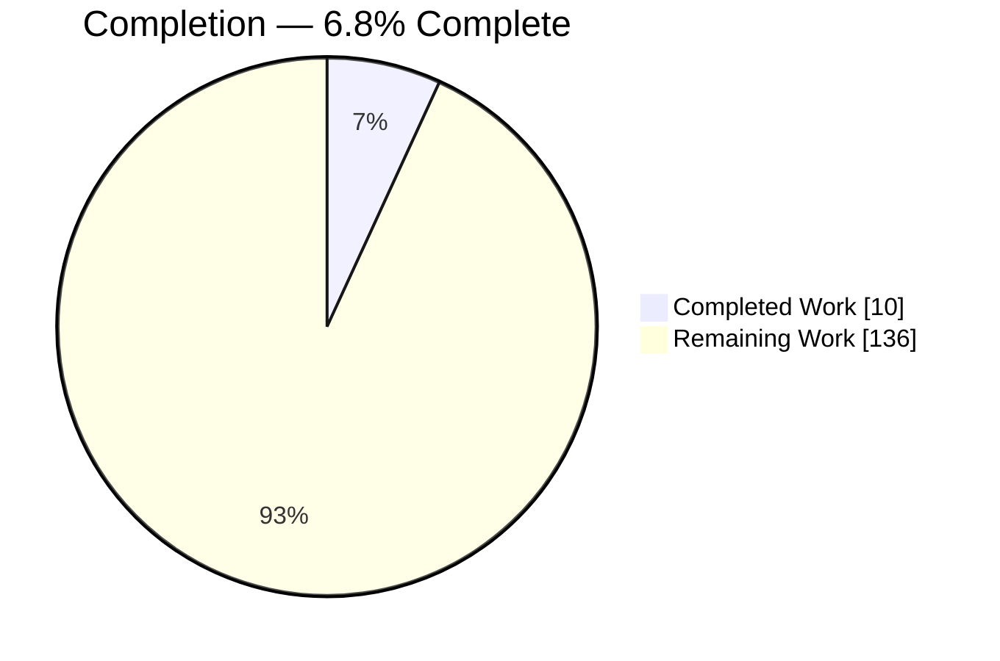
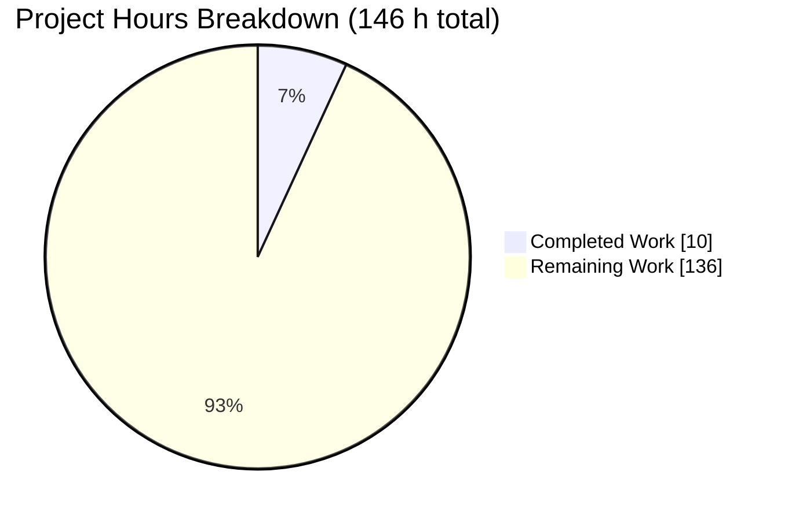
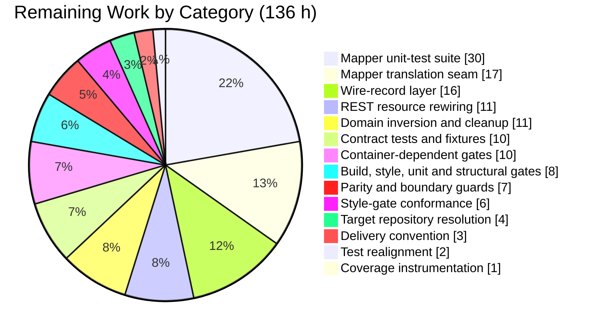
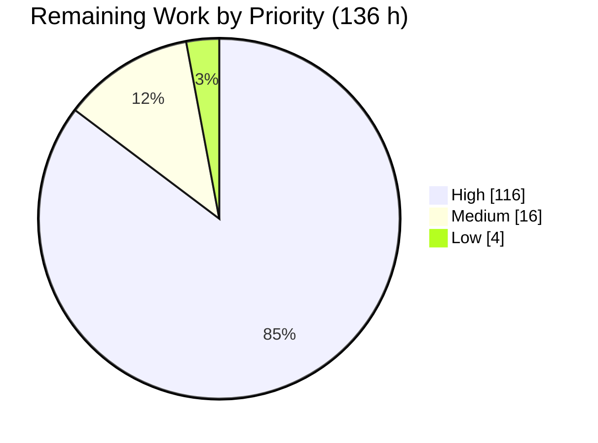
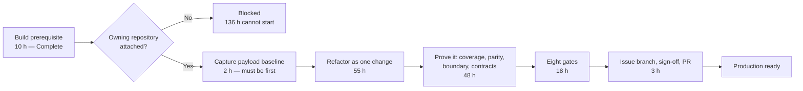

# 1. Executive Summary

## 1.1 Project Overview

The goal was to finish the Anti-Corruption Layer at the REST boundary of the Debezium Management Platform's conductor service: every endpoint exchanging only dedicated wire records, all translation confined to one mapper package, no persistence or internal type reaching a client, and every JSON payload byte-for-byte unchanged. Consumers are the platform's web console and any API client. The work is server-side Java on Quarkus.

That service is not part of this repository. This is core Debezium at `3.7.0-SNAPSHOT`, and its role toward the conductor is to supply that service's Maven parent and build gates. That role is provisioned and verified; the refactor is not delivered.

## 1.2 Completion Status



**Calculation:** 10 / (10 + 136) × 100 = **6.8%**

| Metric | Value |
|--------|-------|
| **Total Hours** | **146** |
| Completed Hours (AI + Manual) | 10 (AI 10 + Manual 0) |
| Remaining Hours | 136 |
| **Percent Complete** | **6.8%** |

Completed = Dark Blue `#5B39F3`; Remaining = White `#FFFFFF`.

## 1.3 Key Accomplishments

- ✅ Conductor build prerequisite published at `3.7.0-SNAPSHOT` — 62 reactor artefacts, in dependency order.
- ✅ All three inherited build gates confirmed inside their artefacts: Checkstyle ruleset, suppressions, Eclipse formatter profile.
- ✅ The conductor's 13 downstream build dependencies resolve offline, including the coverage agent jar.
- ✅ Whole reactor green: 62 of 62 modules, `BUILD SUCCESS` in 12 min 35 s.
- ✅ Unit suite green: **3,589 tests, 0 failures, 0 errors, 12 skipped**.
- ✅ Formatter, import-sort, Checkstyle, Revapi and Enforcer gates all clean, rewriting nothing.
- ✅ Container path works: Kafka, Kafka Connect and PostgreSQL start; a Debezium connector registers.
- ✅ The repository, path and build job that own the conductor identified from this repository's own configuration.

## 1.4 Critical Unresolved Issues

| Issue | Impact | Owner | ETA |
|-------|--------|-------|-----|
| The conductor service targeted by the plan is not part of this repository, so the boundary refactor is undelivered | No requirement of the plan is satisfied; there is no refactored code to release | Platform / repository owner | Blocked until the owning repository is attached |
| None of the eight verification gates has been executed against the target | No build, coverage, contract-parity or regression evidence exists for the refactor | Engineering | ~18 h once the target is reachable |
| The byte-identical payload baseline has not been captured, and it must be taken from a pristine tree before any source edit | The plan's hardest acceptance criterion cannot be falsified; the capture window closes the moment editing begins | Engineering | 2 h — must be the first action |
| Mapper line coverage cannot be measured, because no coverage tooling exists anywhere in the build chain | The stated "100% line coverage for all mapper classes" criterion cannot be evidenced | Engineering | 1 h |

## 1.5 Access Issues

| System/Resource | Type of Access | Issue Description | Resolution Status | Owner |
|-----------------|----------------|-------------------|-------------------|-------|
| `debezium/debezium-platform` — the repository that owns `debezium-platform-conductor` | Repository read/write | Not attached to this project, so the service the plan targets cannot be reached, built, tested or changed | Open | Platform / repository owner |

Everything else is clear: this checkout is readable and writable, and no credential, secret or environment variable is needed — every artefact resolves anonymously, and both Maven Central and the container registry are reachable.

## 1.6 Recommended Next Steps

1. **[High]** Attach `debezium/debezium-platform` and re-run the five pre-flight checks against `debezium-platform-conductor`.
2. **[High]** Capture the four golden payload fixtures from the pristine tree before editing any source.
3. **[High]** Land the refactor as one indivisible change — records, mappers, resources, domain inversion, deletions and imports together.
4. **[High]** Prove it: mapper coverage, parity and boundary guards, then all eight gates including the container-dependent ones.
5. **[Medium]** Deliver on an issue-linked, signed-off branch and open the pull request against the owning repository.

# 2. Project Hours Breakdown

## 2.1 Completed Work Detail

| Component | Hours | Description |
|-----------|-------|-------------|
| JDK 21 and Maven toolchain provisioning | 2 | OpenJDK 21.0.11+10 matched to the build's own floor (`pom.xml:75` `jdk.min.version` resolves to 21); Maven supplied by `./mvnw`, wrapper-pinned to 3.9.12 and also placed on `PATH`; heap and metaspace sized for the reactor; offline resolution confirmed against a primed local repository |
| Conductor build parents published at `3.7.0-SNAPSHOT` | 2 | All 62 reactor projects built and installed, giving the downstream service the `debezium-parent`, `debezium-bom`, `debezium-checkstyle`, `debezium-ide-configs`, `debezium-revapi` and `debezium-util` artifacts it declares; `support/revapi` published ahead of `debezium-parent`, which references it as a plugin dependency |
| Build-gate artefacts and dependency cache verified | 2 | Confirmed the Checkstyle ruleset and its suppressions inside `debezium-checkstyle`, and `eclipse/debezium-formatter.xml` inside `debezium-ide-configs` — the three gates the conductor inherits; pre-resolved the conductor's 13 downstream build dependencies including the mapper processor, the entity-view integrations and the coverage agent jar |
| Build-chain verification across the reactor | 2 | `verify` with integration tests skipped: `BUILD SUCCESS` in 12 min 35 s, 62 of 62 modules; formatter validate, import-sort check, Checkstyle audits, Revapi and Enforcer all executed clean, with no source file rewritten |
| Container runtime harness verification | 1 | Container-backed integration test green in 36.9 s: Kafka, Kafka Connect and PostgreSQL images pulled and started, a Debezium PostgreSQL connector registered and validated, containers reclaimed afterwards |
| Target reconciliation and pre-execution checks | 1 | Five-check pre-flight executed; the parent-and-gate check passes while the target-module checks do not; the nearest structural analogue in this repository confirmed to be an unrelated JMX and Kafka-Connect validation surface with no mapper seam, and therefore unsuitable |
| **Total** | **10** | |

## 2.2 Remaining Work Detail

| Category | Hours | Priority |
|----------|-------|----------|
| Target repository resolution and pre-flight re-verification | 4 | High |
| Wire-record layer — 16 new types (two persistence-enum mirrors, a raw-payload serializer and three carriers, six relocated and four mirrored records) plus 3 record updates | 16 | High |
| Mapper translation seam — 3 new mappers and 3 extended mappers | 17 | High |
| REST resource rewiring across 5 resources | 11 | High |
| Domain dependency inversion, new result record, service signature change, error-payload extraction, 6 deletions and 13 import corrections | 11 | High |
| Mapper unit-test suite to 100% line coverage across 10 mappers | 30 | High |
| Byte-level payload contract tests and golden fixture capture | 10 | High |
| Verification gates: build, style, unit and structural conformance | 8 | High |
| Container-dependent gates: contract parity, full pre-existing integration suite, generated-specification stability | 10 | High |
| Enum serialization-parity tests and the reflective boundary guard | 7 | Medium |
| Style-gate conformance for every new and edited file | 6 | Medium |
| Delivery convention — issue-linked branch, per-commit sign-off, pull request | 3 | Medium |
| Monitoring service test realignment onto the new domain return types | 2 | Medium |
| Coverage instrumentation in the module build | 1 | Medium |
| **Total** | **136** | |

## 2.3 Hours Reconciliation

| Check | Expected | Actual | Result |
|-------|----------|--------|--------|
| Section 2.1 total = Completed Hours in Section 1.2 | 10 | 10 | ✅ |
| Section 2.2 total = Remaining Hours in Section 1.2 | 136 | 136 | ✅ |
| Section 2.1 + Section 2.2 = Total Hours in Section 1.2 | 146 | 146 | ✅ |
| Section 2.2 total = "Remaining Work" in the Section 7 chart | 136 | 136 | ✅ |
| Completed / Total × 100 = Percent Complete | 6.8% | 10 / 146 = 6.8% | ✅ |

The 136 remaining hours divide into **105 hours of plan deliverables**, none of which has been started, and **31 hours of path-to-production work** — target resolution, style conformance, gate execution and the delivery convention. The 10 completed hours are all path-to-production: the build prerequisite the conductor depends on, provisioned and verified.

Estimate confidence: **high** on the completed 10 hours, since each line was confirmed by direct command output. **Medium** on the 105-hour deliverable estimate, which is derived from the plan's own file-by-file inventory — 30 discrete items across roughly 45 files, 13 new test classes, and a mapper surface measured at 405 lines before any new mapper is added. **Medium** on the 31-hour path-to-production estimate. The widest band sits on the single largest line, the 30 hours of mapper tests, because the coverage denominator grows with the three new mappers.

# 3. Test Results

Every figure below was produced by executing the suite in this environment and reading the resulting test reports. The unit pass ran `verify` with integration tests skipped and the read-only lint goals applied, finishing `BUILD SUCCESS` in 12 min 35 s across 62 of 62 modules; the runtime row ran the container-backed harness separately.

| Area / Category | Framework | Tests | Passed | Failed | Coverage | What This Proves |
|-----------------|-----------|------:|-------:|-------:|----------|------------------|
| Connector engine and framework (`debezium-connector-common`) | JUnit 5 / Surefire | 650 | 650 | 0 | not instrumented | Change-event queueing, offset handling, snapshotting, signalling and connector configuration validation behave as specified |
| Relational source connectors (MySQL, MariaDB, PostgreSQL, SQL Server, Oracle, shared binlog core) | JUnit 5 / Surefire | 1,486 | 1,475 | 0 | not instrumented | DDL parsing, schema evolution and configuration resolution hold across every relational source (11 skipped by environment guards) |
| Document source connector (MongoDB) | JUnit 5 / Surefire | 185 | 184 | 0 | not instrumented | Document-level capture, field selection and collection filtering hold (1 skipped) |
| Sink path (`debezium-connector-jdbc`, `debezium-sink`) | JUnit 5 / Surefire | 455 | 455 | 0 | not instrumented | Record buffering, naming strategies and dialect resolution hold on the write side |
| Core libraries and embedded engine (`debezium-util`, `-api`, `-config`, `-ddl-parser`, `-embedded`) | JUnit 5 / Surefire | 288 | 288 | 0 | not instrumented | Shared configuration, type conversion and in-process engine plumbing hold |
| Storage, packaging, transforms and tooling (`debezium-connect-plugins`, 11 storage providers, AI transforms, OpenLineage, scripting, schema generator, interceptor, benchmarks) | JUnit 5 / Surefire | 525 | 525 | 0 | not instrumented | Offset and history providers, single-message transforms, plugin descriptors and lineage emission hold |
| Container-backed runtime integration (`debezium-testing/debezium-testing-testcontainers`) | JUnit 5 / Failsafe / Testcontainers | 2 | 2 | 0 | n/a | A live Kafka Connect deployment accepts, registers and validates a Debezium PostgreSQL connector |
| **TOTAL** | — | **3,591** | **3,579** | **0** | not instrumented | — |

Skipped: 12 (11 relational, 1 document), each guarded by an environment precondition rather than a failure. Errors: 0.

"Not instrumented" is a statement of fact, not an omission: no coverage tool is configured in any of the 62 build files in this repository, so there is no coverage figure to report and none has been estimated.

### Not Covered

- **The plan's entire scope has no test here, because it has no code here.** Uncovered by any test: the wire-record layer (16 types including the two persistence-enum mirrors with their nine differing JSON spellings, and the three raw-payload carriers), the mapper translation seam (three new mappers and three extended ones), the five rewired REST resources, the domain dependency inversion and its new query-result record, the extracted shared error payload, and the byte-level payload contracts for the catalog, component-descriptor, connection-schema and monitoring endpoints. A human must exercise all of these in the repository that owns the conductor service.
- **No mapper class anywhere is covered by a line-coverage measurement**, and none can be until coverage instrumentation is added to the build. The plan's own pre-refactor measurement put that surface at 405 lines across 11 classes with 37 lines covered; it grows with each new mapper.
- **The 462 container-dependent integration test classes present in this tree were not exercised.** The unit pass skips them by design, and only the single runtime harness test above was driven. A human should run the container suites for each connector before release.
- **The conductor's generated API specification, its path/operation/status surface and its pipeline-log text channels** are untested, for the same reason — they are not present in this repository.

# 4. Runtime Validation & UI Verification

The following was driven for real in this environment and observed, not inferred.

- ✅ **Reactor build and artefact publication** — all 62 projects compiled, packaged and installed at `3.7.0-SNAPSHOT`, including the six artefacts the conductor service declares as its parent and build gates.
- ✅ **Unit suite across the reactor** — executed end to end to `BUILD SUCCESS` in 12 min 35 s with no failures and no errors.
- ✅ **Style and API-compatibility gates** — formatter validation, import-sort checking, Checkstyle audits, Revapi and Enforcer all executed clean, and `git status` was byte-clean before and after, confirming the read-only goals rewrote nothing.
- ✅ **Offline dependency resolution** — the whole reactor resolves from the primed local repository with no credentials and no `settings.xml`.
- ✅ **Container engine** — Docker 29.7.0 on the overlay2 driver, reachable, pulling images from the public registry.
- ✅ **Kafka, Kafka Connect and PostgreSQL topology** — started from container images, reached health, and was reclaimed cleanly at the end of the run.
- ✅ **Debezium PostgreSQL connector registration** — submitted to the running Kafka Connect instance and validated against it, exercising the connector configuration and validation path at runtime.
- ❌ **The conductor's REST surface — catalog, component descriptor, monitoring panels and panel query, connection validation, connection schemas, available collections, pipeline signals and source signal verification — was never driven at runtime.** That service is not part of this repository, so no endpoint was reachable and no payload was captured.
- ❌ **The conductor's generated API specification and its pipeline-log WebSocket and text-download channels were never driven at runtime**, for the same reason.
- ⚠ **No user interface exists in scope or in this repository.** The plan records the platform's web console as out of scope and its API types as hand-written rather than generated; byte-identical payloads mean no console change is implied, so there is no rendered surface to verify.

# 5. Compliance & Quality Review

## 5.1 Compliance Matrix

Each row states where the deliverable stands now.

| # | Deliverable | Benchmark | Status | Progress |
|---|-------------|-----------|--------|----------|
| 1 | Wire records for the five pre-serialized-payload endpoints (four catalog reads plus connection schemas) | Every boundary method returns a dedicated wire type | ❌ Not started | ░░░░░░░░░░ 0% |
| 2 | Internal transfer records removed from the monitoring, connection, pipeline and source resources | No internal-transfer type on the wire | ❌ Not started | ░░░░░░░░░░ 0% |
| 3 | Persistence enums removed from the three wire records that carry them | No persistence type reaches the serializer, even transitively | ❌ Not started | ░░░░░░░░░░ 0% |
| 4 | Monitoring service dependency inversion — service returns domain types, mapper does the shaping | No domain service names a wire type | ❌ Not started | ░░░░░░░░░░ 0% |
| 5 | Three new mappers (catalog, monitoring, signal) and three extended mappers | The mapper package is the sole translation seam | ❌ Not started | ░░░░░░░░░░ 0% |
| 6 | Package ownership reconciled — six types relocated, six mirrored, one left alone | Ownership decided and applied | ⚠ Decided, not applied | ░░░░░░░░░░ 0% |
| 7 | Mapper unit tests at 100% line coverage across all ten mappers | 100% line coverage, measured | ❌ Not started | ░░░░░░░░░░ 0% |
| 8 | Byte-identical JSON on every endpoint | Payload equality proven against a captured baseline | ❌ Unverifiable — no baseline captured | ░░░░░░░░░░ 0% |
| 9 | Enum-alias parity and the reflective boundary guard | Drift is a build failure, not a runtime surprise | ❌ Not started | ░░░░░░░░░░ 0% |
| 10 | The eight verification gates — build, style, unit, coverage, contract parity, structural conformance, regression, specification stability | All eight pass | ❌ Not executed against the target | ░░░░░░░░░░ 0% |
| 11 | Build prerequisite for the conductor: parents and the three build gates published at `3.7.0-SNAPSHOT`, toolchain provisioned, reactor green offline | Downstream build can resolve and gate correctly | ✅ Pass — 62 artefacts published, gates verified inside their jars, 3,589 tests green | ██████████ 100% |
| 12 | Contribution convention — issue-linked branch, per-commit sign-off, pull request against the owning repository | Convention honoured | ❌ Not started | ░░░░░░░░░░ 0% |

## 5.2 AAP & Rule Divergences and Gaps

**No user-specified rules were provided for this project**, so no rule divergence is possible. The divergences below are all departures from the Agent Action Plan.

| What the AAP/Rule Required | What Was Delivered Instead | Why It Diverged | Impact | Remediation |
|---|---|---|---|---|
| Convert the conductor's REST boundary into a uniformly applied Anti-Corruption Layer: 16 new wire records, 3 new mappers, 5 rewired resources, a domain dependency inversion, 6 deletions and 13 import corrections | No change to any file — the working branch is identical to its source branch | The conductor service is not part of this repository; the plan required a halt rather than a substitute (**Sanctioned**) | None of the plan's eight goals is satisfied; nothing refactored exists to release | Attach `debezium/debezium-platform` and execute the change against `debezium-platform-conductor` there |
| Pass eight verification gates: build, style, unit, coverage, contract parity, structural conformance, full regression, specification stability | None executed against the target | There is no target module here to build, cover, contract-test or regress | No behaviour-preservation or regression evidence exists for the refactor | Run all eight in the owning repository; this environment can now run the container-dependent ones |
| Capture four golden payload fixtures from the pristine pre-refactor tree before any source edit, treating the step as irreversible | Not captured | The pre-refactor tree of the target module was never reachable from here | The byte-identical payload criterion has no falsifiable baseline | Capture in record mode as the very first action, before editing source |
| Make "100% line coverage for all mapper classes" measurable via a two-line coverage-agent property | Not added; no coverage tooling exists in any of the 62 build files in this repository | The change belongs in the conductor's own build file, which is not present here | The headline coverage criterion cannot be evidenced by any build | Add the placeholder property and compose it into both test-runner argument lines |
| Deliver on an issue-linked branch with per-commit sign-off, per `CONTRIBUTING.md` and `dco.txt` | The working branch carries zero commits; its head equals its source branch | No change existed to commit | The contribution convention remains to be honoured | Branch and sign off in the owning repository |
| Defer the container-dependent gates on the basis that no container runtime was available | A container runtime is available and container-backed tests run green here | The execution environment gained Docker 29.7.0 after the plan was written | Favourable — the deferral is no longer warranted | Run those gates in this environment once the target is correct |

**Divergence 1 — the target service is not in this repository.** The plan requires all ten classes of the conductor's REST package to accept and return only wire records, with translation confined to one mapper package. Nothing was changed: the branch head equals its source branch, and `git diff` against it returns no files and no lines. The cause is structural. This repository's own configuration builds the conductor from elsewhere — `.github/workflows/platform-conductor-workflow.yml` checks this repository out to `core`, then separately checks out `debezium/debezium-platform` to `platform-conductor` and builds `platform-conductor/debezium-platform-conductor`. The plan required a halt here and explicitly forbade refactoring `debezium-connector-common/src/main/java/io/debezium/rest` as a stand-in, so honouring that is the sanctioned outcome. The work belongs in the platform repository.

**Divergence 2 — the eight verification gates were not executed.** The plan defines build, style, unit, coverage, contract-parity, structural-conformance, regression and specification-stability gates, and names the regression gate over the thirteen pre-existing integration classes as the primary behaviour-preservation evidence. None ran against the target, because there is no module here to compile or exercise. Read `.github/actions/build-platform-conductor/action.yml`: it delegates the conductor's build and test steps to composite actions living in the platform repository, with `working-directory` set to that separate checkout. Consequently no statement can yet be made about whether the refactor preserves behaviour. Budget roughly 18 hours of gate execution once the module is reachable, 10 of it container-dependent.

**Divergence 3 — the byte-parity baseline was never captured.** The plan's hardest constraint is that every emitted payload stay byte-for-byte identical, and it prescribes capturing four golden fixtures — current catalog, component descriptor, panels list and panel query — from the pre-refactor tree in record mode, warning that the opportunity is irreversible once editing starts. Those fixtures do not exist. This matters more than the missing code: without them, "byte-identical" degrades from a falsifiable test into an assertion, and the failure modes it guards against — reordered keys, normalised whitespace, silently dropped unknown descriptor fields — are precisely the ones no field-by-field assertion catches. Capture the fixtures first, commit them, and only then begin editing.

**Divergence 4 — the coverage criterion is still unmeasurable.** The plan sets 100% line coverage for every mapper class as an acceptance criterion and prescribes a two-line placeholder property composed into the test-runner argument lines, having established that the build carries no coverage tooling at all. That finding holds here: none of the 62 build files in this repository configures any coverage tool. The mechanism has a precedent to copy — `debezium-parent/pom.xml:49` declares an empty `mockito.argLine` property, and lines 104 and 275 compose it into the surefire and failsafe argument lines respectively. Add a coverage placeholder the same way. Without it, no build can produce the number the criterion demands, so the criterion cannot be signed off.

**Divergence 5 — the delivery convention is unhonoured.** `CONTRIBUTING.md` and `dco.txt` require an issue-linked branch and a Developer Certificate of Origin sign-off on every commit, and the plan carries that forward as a delivery constraint. The working branch holds no commits at all: its head is the same object as its source branch, and no commit is attributed to automated authorship anywhere in the 14,494-commit history. The cause is simply that no change existed to commit, so this is a consequence of Divergence 1 rather than an independent lapse. It still needs closing deliberately, because the branch that eventually carries this work must be created in the owning repository and every commit on it signed off.

**Divergence 6 — the container-runtime constraint no longer applies.** The plan records that no container runtime was available when it was written, and on that basis defers the contract-parity, full-regression and specification-stability gates to a different environment, while insisting they are not optional. That constraint has lifted: Docker 29.7.0 is available on the overlay2 driver, images pull from the public registry, and a container-backed integration test ran green here in under a minute, starting Kafka, Kafka Connect and PostgreSQL and registering a connector. This is a favourable divergence and the only action it implies is to stop deferring — once the module is reachable, run all three of those gates in this environment rather than handing them onward.

# 6. Risk Assessment

These are forward-looking: what can still go wrong between here and production.

| Risk | Category | Severity | Probability | Mitigation | Status |
|------|----------|----------|-------------|------------|--------|
| Byte-identical payload parity has no captured baseline, and the window to capture one closes the moment source editing begins | Technical | High | Medium | Capture the four golden payload fixtures in record mode as the very first action and commit them before any edit; compare exact bytes for the pass-through payloads and a canonical tree for monitoring with only the wall-clock duration field normalised | Open |
| "100% line coverage for all mapper classes" cannot be measured, so the criterion cannot be signed off | Technical | Medium | High | Add an empty coverage-agent argument-line placeholder and compose it into both the surefire and failsafe argument lines, following the `mockito.argLine` precedent at `debezium-parent/pom.xml:49,104,275`; no coverage tool is configured in any of the 62 build files today | Open |
| Two serializer generations coexist on the conductor's classpath, so an annotation from the wrong one compiles cleanly, is ignored by the response writer, and changes the payload with no build failure | Technical | High | Medium | Enforce a single-generation import rule mechanically, and back it with the byte-level payload tests as the second line of defence | Open |
| Persistence-enum mirror drift in the nine constants whose JSON spelling differs from the constant name | Technical | High | Low | The compiler rejects a divergent constant set, but never validates the alias values that form the actual contract — pair it with serialization-parity tests over every constant in both mirrors | Open |
| Reshaping the error payload shared by seven exception handlers could widen the internal detail reaching clients | Security | Medium | Low | Preserve the `(error, details)` shape exactly during the extraction and re-run the validation-failure, not-found and unique-constraint paths before release | Open |
| The style gates break the build and also police test sources, while the default lint goals rewrite source in place | Operational | Medium | Medium | Checkstyle runs with `failsOnError`, error severity and test sources included (`debezium-parent/pom.xml:372-375`); always pass `-Dformat.formatter.goal=validate -Dformat.imports.goal=check` for a read-only check, since the defaults at lines 35-36 are `format` and `sort` | Open |
| The conductor's Maven parent and all three of its build gates come from this repository at `3.7.0-SNAPSHOT`, so version drift here silently breaks its build | Integration | High | Medium | Install the parents from a pinned commit before each downstream build, publishing `support/revapi` ahead of `debezium-parent`, and keep the declared parent version aligned | Open |
| The conductor build job binds composite actions that live in another repository and are tracked at a moving branch | Integration | Medium | Medium | `.github/actions/build-platform-conductor/action.yml` references those actions at `@main`; pin them to a tag or commit so an upstream change cannot break this repository's job without warning | Open |

# 7. Visual Project Status

### Overall Hours — 6.8% Complete

Colour key: Completed Work = Dark Blue `#5B39F3`; Remaining Work = White `#FFFFFF`.



### Remaining Hours by Category



### Remaining Hours by Priority



### Where the Effort Sits



The category chart sums to 136, matching the Remaining Hours in Section 1.2 and the Section 2.2 total. The priority chart sums to the same 136. The critical path above is the same hours regrouped by sequence: 2 + 55 + 48 + 18 + 3 = 126, with the remaining 10 hours — target repository resolution (4) and style-gate conformance (6) — running alongside rather than on the path.

# 8. Summary & Recommendations

The project stands at **6.8% complete** against its plan — 10 of 146 hours. What was delivered is the foundation the intended work depends on rather than the work itself: this repository has been provisioned and verified as the build authority for the Debezium Management Platform's conductor service. All 62 reactor projects are published at `3.7.0-SNAPSHOT`, giving that service the parent POM, the dependency BOM and the three build gates it declares; the Checkstyle ruleset and the Eclipse formatter profile were opened inside their published artefacts and confirmed correct; and the 13 downstream build dependencies the conductor needs — including the annotation processor that generates its mappers, the entity-view integrations that protect its read projections, and the coverage agent its acceptance criterion requires — all resolve offline with no credentials.

That foundation was verified rather than assumed. The whole reactor builds green in 12 minutes 35 seconds, the unit suite passes at **3,589 tests with zero failures and zero errors**, the style and API-compatibility gates run clean without rewriting a single source file, and the container path works end to end: a Kafka, Kafka Connect and PostgreSQL topology starts from images and accepts a registered Debezium PostgreSQL connector. A downstream conductor build against this repository will resolve, gate and compile.

The boundary refactor itself was not delivered, and the reason is structural rather than technical. The conductor service is not part of this repository. This repository's own automation says so plainly: `.github/workflows/platform-conductor-workflow.yml` checks this repository out to one path, separately checks out `debezium/debezium-platform` to another, and builds the conductor from there, while `.github/workflows/deploy-snapshots.yml` lists the conductor among the external sibling repositories alongside the server and the operator. The plan anticipated exactly this and required a halt rather than a substitute, naming the nearest structural analogue here — an unrelated JMX and Kafka-Connect validation surface with no mapper seam — as forbidden. Honouring that was correct, and it is why the branch carries no commits.

Consequently every one of the plan's eight goals is open: the wire records for the five pre-serialized-payload endpoints, the removal of internal transfer records and persistence enums from the boundary, the monitoring service's dependency inversion, the three new mappers, the mapper test suite at full line coverage, and the byte-parity proof. Two open items deserve more attention than their hour counts suggest. First, the golden payload baseline has never been captured, and the plan is right that the opportunity is irreversible — capture it from the pristine tree before the first edit, or the hardest acceptance criterion becomes an assertion instead of a test. Second, line coverage is unmeasurable: no coverage tool is configured in any of the 62 build files here, so the headline "100% for all mappers" cannot be signed off until an argument-line placeholder is added, following the `mockito.argLine` pattern already present at `debezium-parent/pom.xml:49,104,275`.

**Production readiness: not ready, and correctly so.** Nothing was changed, so nothing regressed — this repository is exactly as releasable as it was, and its own suite proves it. The conductor's boundary refactor, by contrast, has neither code nor evidence. The critical path is short and well understood: attach the owning repository (4 h), capture the baseline (2 h), land the refactor as one indivisible change (55 h), prove it with coverage, parity, boundary and contract tests (48 h), clear all eight gates including the container-dependent ones this environment can now run (18 h), and deliver on an issue-linked, signed-off branch (3 h). Success is measurable and binary: ten REST classes exposing only wire records, a structural check returning matches solely inside the mapper package, thirteen pre-existing integration classes passing unedited, and every payload byte-identical to a committed baseline.

# 9. Development Guide

Every command below was executed in this environment and its outcome observed. Run them from the repository root unless stated otherwise.

## 9.1 System Prerequisites

| Requirement | Version verified | Notes |
|-------------|------------------|-------|
| JDK | OpenJDK **21.0.11+10** | `pom.xml:75` sets the floor via `jdk.min.version`, which resolves to 21. A JDK 21 toolchain is mandatory even though connector modules compile at release 17. |
| Maven | **3.9.12** via `./mvnw` | Pinned in `.mvn/wrapper/maven-wrapper.properties`. Never needed on `PATH` — always use the wrapper. The build's own managed baseline (`version.maven`) is 3.9.8. |
| Docker | **29.7.0** with `docker compose`, overlay2 | Required only for integration tests. Verified reachable, pulling from the public registry. |
| Git + Git LFS | 2.51.0 / 3.7.1 | Standard checkout. |
| Node.js | not required | This repository contains no `package.json`. |
| Memory | ≥ 8 GB free | The reactor needs a large heap; see `MAVEN_OPTS` below. |

No credentials, tokens, API keys or environment variables are needed to build. There is no `settings.xml`, and every artefact resolves anonymously from Maven Central, `packages.confluent.io` and jboss-public.

## 9.2 Environment Setup

```bash
# Pin the toolchain and size the JVM for the reactor.
export JAVA_HOME=/usr/lib/jvm/java-21-openjdk-amd64
export PATH="$JAVA_HOME/bin:$PATH"
export MAVEN_OPTS="-Xmx6g -XX:MaxMetaspaceSize=768m"

# Confirm.
java -version          # openjdk version "21.0.11"
./mvnw -v | head -3    # Apache Maven 3.9.12 ... runtime: .../java-21-openjdk-amd64
docker info --format 'ServerVersion={{.ServerVersion}} Driver={{.Driver}}'
```

⚠ **The single most important flag pair in this repository.** `debezium-parent/pom.xml:35-36` defaults the formatter and import-sort goals to `format` and `sort` — those goals **rewrite your source files in place**. For any read-only check, always pass:

```bash
-Dformat.formatter.goal=validate -Dformat.imports.goal=check
```

Checkstyle then runs with `failsOnError=true`, error-level severity and test sources included (`debezium-parent/pom.xml:372-375`), so a style slip in a test file breaks the build exactly as one in main source does.

## 9.3 Build and Dependency Installation

```bash
# Full build, no tests. Populates ~/.m2 with all 62 reactor artefacts at 3.7.0-SNAPSHOT.
./mvnw -B clean install -DskipTests -DskipITs \
  -Dformat.formatter.goal=validate -Dformat.imports.goal=check
```

```bash
# Fast iteration on one module. -Dquick skips formatter, import-sort and Checkstyle.
# Observed: BUILD SUCCESS in 3.139 s
./mvnw -B -o clean verify -pl debezium-api -Dquick
```

```bash
# Prove the local repository is complete: resolve one module fully offline.
# Observed: exit 0
./mvnw -o -q dependency:resolve -pl debezium-connector-postgres
```

## 9.4 Publishing the Build Prerequisite for the Conductor Service

The Management Platform's conductor lives in `debezium/debezium-platform` and declares this repository's `debezium-parent` as its Maven parent, plus `debezium-checkstyle`, `debezium-ide-configs` and `debezium-revapi` as its build gates and `debezium-util` on its test classpath. Publish them locally before building it:

```bash
# Step 1 — the aggregator POM only. Observed: BUILD SUCCESS in 1.021 s
./mvnw -N install -DskipTests

# Step 2 — the gate and parent modules, in one invocation.
# Pass the whole list at once: the reactor then orders support/revapi ahead of
# debezium-parent, which references it as a plugin dependency.
# Observed: BUILD SUCCESS in 3.054 s
#   Debezium BOM ... Debezium IDE Formatting Rules ... Debezium Checkstyle Rules
#   ... Debezium Revapi Rules ... Debezium Parent POM
./mvnw install -DskipTests \
  -pl support/revapi,support/checkstyle,support/ide-configs,debezium-bom,debezium-parent
```

Then confirm the gate payloads really are inside the artefacts:

```bash
unzip -l ~/.m2/repository/io/debezium/debezium-checkstyle/3.7.0-SNAPSHOT/*.jar | grep -i checkstyle
#   checkstyle-suppressions.xml
#   checkstyle.xml
unzip -l ~/.m2/repository/io/debezium/debezium-ide-configs/3.7.0-SNAPSHOT/*.jar | grep -i formatter
#   eclipse/debezium-formatter.xml
```

## 9.5 Running the Tests

```bash
# Full unit suite — the authoritative regression command.
# Observed: BUILD SUCCESS in 12:35, 62/62 modules,
#           3,589 tests, 0 failures, 0 errors, 12 skipped
./mvnw -B -fae verify -DskipITs \
  -Dformat.formatter.goal=validate -Dformat.imports.goal=check
```

```bash
# One test class. Observed: Tests run: 73, Failures: 0, Errors: 0, Skipped: 0
./mvnw -B -o test -pl debezium-util -Dtest='StringsTest' -DfailIfNoTests=false \
  -Dformat.formatter.goal=validate -Dformat.imports.goal=check
```

```bash
# Read-only lint on one module, proving nothing is rewritten.
# Observed: BUILD SUCCESS in 3.927 s; git status clean before and after
git status --porcelain | wc -l    # 0
./mvnw -B -o verify -pl debezium-util -DskipTests -DskipITs \
  -Dformat.formatter.goal=validate -Dformat.imports.goal=check
git status --porcelain | wc -l    # still 0
```

```bash
# Container-backed runtime check. Requires Docker.
# Observed: BUILD SUCCESS in 42.204 s; Tests run: 2, Failures: 0
# Starts Kafka, Kafka Connect and PostgreSQL, then registers a Debezium connector.
./mvnw -B verify -pl debezium-testing/debezium-testing-testcontainers \
  -Dit.test=DebeziumContainerIT -DskipTests=true -DskipITs=false
```

Aggregate results across a run without re-reading the console:

```bash
python3 - <<'PY'
import glob, xml.etree.ElementTree as ET
t=f=e=s=0
for p in glob.glob('**/target/surefire-reports/TEST-*.xml', recursive=True):
    r = ET.parse(p).getroot()
    t += int(r.get('tests', 0)); f += int(r.get('failures', 0))
    e += int(r.get('errors', 0)); s += int(r.get('skipped', 0))
print(f"tests={t} failures={f} errors={e} skipped={s} passed={t-f-e-s}")
PY
```

## 9.6 Verification Steps

| Step | Command | Expected |
|------|---------|----------|
| Toolchain correct | `./mvnw -v \| head -3` | Maven 3.9.12 on a Java 21 runtime |
| Reactor complete | `ls ~/.m2/repository/io/debezium \| wc -l` | 64 artefact directories |
| Snapshot version present | `find ~/.m2/repository/io/debezium -maxdepth 2 -type d -name 3.7.0-SNAPSHOT \| wc -l` | 62 |
| Build green | `./mvnw -B clean install -DskipTests -DskipITs -Dformat.formatter.goal=validate -Dformat.imports.goal=check` | `BUILD SUCCESS`, 62 modules |
| Tests green | see §9.5 | 3,589 tests, 0 failures |
| Style gates clean | any `verify` with the read-only goal flags | `Audit done.` with no violations, `git status` unchanged |
| Runtime path works | see §9.5 container check | 2 tests pass, containers reclaimed |

## 9.7 Troubleshooting

- **A routine check rewrote my source files.** The formatter and import-sort goals default to `format` and `sort` (`debezium-parent/pom.xml:35-36`). Always pass `-Dformat.formatter.goal=validate -Dformat.imports.goal=check`, and recover with `git checkout -- .`.
- **`Could not find artifact io.debezium:debezium-revapi:jar:3.7.0-SNAPSHOT`** while publishing parents. Pass the whole `-pl` list from §9.4 in a single invocation so the reactor sequences `support/revapi` before `debezium-parent`; installing them one at a time in the wrong order fails.
- **`OutOfMemoryError` or metaspace exhaustion during the reactor build.** Set `MAVEN_OPTS="-Xmx6g -XX:MaxMetaspaceSize=768m"` and avoid building in parallel with other heavy processes.
- **Integration tests fail to start containers.** Confirm `docker info` responds, that images can be pulled, and that `docker.host.address` resolves. The unit suite is unaffected — it skips integration tests entirely.
- **A test-runner agent fails to load** when a test goal is invoked standalone. The argument lines reference properties populated during the normal lifecycle (`debezium-parent/pom.xml:49,104,275`); run a lifecycle goal such as `test` or `verify` rather than the plugin goal directly.
- **A test selector matches two classes.** Some simple names occur in more than one package. Select by fully-qualified class name to disambiguate.
- **Checkstyle fails on a test file.** That is intentional — `includeTestSourceDirectory=true` holds tests to the same bar as main source.

## 9.8 Example Usage

This repository publishes libraries, connector plugins and build tooling; it exposes no service of its own and binds no port. The two representative flows are:

```bash
# 1. Build a connector plugin archive for deployment into Kafka Connect.
./mvnw -B clean install -DskipTests -DskipITs -pl debezium-connector-postgres -am \
  -Dformat.formatter.goal=validate -Dformat.imports.goal=check
ls debezium-connector-postgres/target/*.tar.gz debezium-connector-postgres/target/*.zip 2>/dev/null
```

```bash
# 2. Exercise a connector against live infrastructure, entirely in containers.
./mvnw -B verify -pl debezium-testing/debezium-testing-testcontainers \
  -Dit.test=DebeziumContainerIT -DskipTests=true -DskipITs=false
# The harness brings up Kafka on 9092, Kafka Connect on 8083 and PostgreSQL on 5432,
# POSTs a connector configuration to the Connect REST API, and asserts it validates.
```

# 10. Appendices

## A. Command Reference

| Purpose | Command |
|---------|---------|
| Full build, no tests | `./mvnw -B clean install -DskipTests -DskipITs -Dformat.formatter.goal=validate -Dformat.imports.goal=check` |
| Full unit suite | `./mvnw -B -fae verify -DskipITs -Dformat.formatter.goal=validate -Dformat.imports.goal=check` |
| Fast single-module loop | `./mvnw -B -o clean verify -pl <module> -Dquick` |
| Read-only lint only | `./mvnw -B -o verify -pl <module> -DskipTests -DskipITs -Dformat.formatter.goal=validate -Dformat.imports.goal=check` |
| One test class | `./mvnw -B -o test -pl <module> -Dtest='<Class>' -DfailIfNoTests=false` |
| One integration test | `./mvnw -B verify -pl <module> -Dit.test='<Class>' -DskipTests=true -DskipITs=false` |
| Aggregator POM only | `./mvnw -N install -DskipTests` |
| Publish the conductor's parents and gates | `./mvnw install -DskipTests -pl support/revapi,support/checkstyle,support/ide-configs,debezium-bom,debezium-parent` |
| Offline resolution check | `./mvnw -o -q dependency:resolve -pl <module>` |
| Structural conformance scan (for the conductor, once reachable) | `grep -rnE 'data\.(dto\|model)\|domain\.views' src/main/java/io/debezium/platform/api/` — every match must fall under `api/mapper/` |
| Disambiguate a duplicated test name | `./mvnw test -Dtest='<fully.qualified.ClassName>'` |

## B. Port Reference

No service in this repository binds a port. These are the ports its container-backed test harnesses use, with the number of references found across the tree.

| Port | Service | References |
|------|---------|-----------:|
| 3306 | MySQL / MariaDB | 85 |
| 9999 | JMX / metrics endpoint | 53 |
| 1521 | Oracle | 33 |
| 27017 | MongoDB | 32 |
| 5432 | PostgreSQL | 30 |
| 9092 | Kafka broker | 24 |
| 8080 | Apicurio registry / HTTP | 21 |
| 1433 | SQL Server | 14 |
| 8083 | Kafka Connect REST API | 9 |
| 8081 | Schema registry | 4 |

## C. Key File Locations

| Path | Why it matters |
|------|----------------|
| `pom.xml` | Aggregator, `io.debezium:debezium-build-parent:3.7.0-SNAPSHOT`, 36 declared modules expanding to 62 reactor projects; Java properties at lines 65-75 |
| `debezium-parent/pom.xml` | Shared lifecycle. Style-gate goal defaults at 35-36; `mockito.argLine` placeholder at 49; surefire argument line at 104; Checkstyle strictness at 372-375; failsafe argument line at 275 |
| `debezium-bom/pom.xml` | Dependency-version alignment for the whole project and its downstream consumers |
| `support/checkstyle`, `support/ide-configs`, `support/revapi`, `support/archunit` | The four build-gate artefacts consumed by this repository and by the conductor service |
| `.mvn/wrapper/maven-wrapper.properties` | Pins Maven 3.9.12 |
| `.github/workflows/platform-conductor-workflow.yml` | Checks this repository out to `core`, checks out `debezium/debezium-platform` to `platform-conductor`, and builds `platform-conductor/debezium-platform-conductor` |
| `.github/actions/build-platform-conductor/action.yml` | Delegates the conductor's build and test steps to composite actions in the platform repository, keyed on `path-conductor` |
| `.github/workflows/deploy-snapshots.yml` | Lists the downstream repositories, including the conductor, alongside the server and operator |
| `debezium-testing/debezium-testing-testcontainers` | The container runtime harness used for the runtime check in Section 4 |
| `debezium-connector-common/src/main/java/io/debezium/rest` | An unrelated JMX and Kafka-Connect validation REST surface — explicitly not a substitute for the conductor's boundary |
| `CONTRIBUTING.md`, `dco.txt`, `AGENTS.md` | Contribution convention, sign-off requirement and repository conventions |

## D. Technology Versions

| Component | Version | Source |
|-----------|---------|--------|
| Project version | 3.7.0-SNAPSHOT | root `pom.xml` |
| Java source level / toolchain floor | 21 | `pom.xml:65` (`debezium.java.source`, `debezium.java.specific.target`) |
| Connector compile release | 17 | `pom.xml` (`debezium.java.connector.target`) — why build logs report release 17 on a JDK 21 toolchain |
| Maven (wrapper / managed baseline) | 3.9.12 / 3.9.8 | wrapper properties / `version.maven` |
| Apache Kafka | 4.3.0 | `version.kafka` |
| Jackson | 2.21.2 | `version.jackson` |
| Testcontainers | 2.0.3 | `version.testcontainers` |
| Mockito | 5.19.0 | `version.mockito` |
| PostgreSQL JDBC | 42.7.11 | `version.postgresql.driver` |
| MySQL binlog client | 0.41.0 | `version.mysql.binlog` |
| MongoDB driver | 5.6.2 | `version.mongo.driver` |
| SQL Server JDBC | 12.4.2.jre8 | `version.sqlserver.driver` |
| Oracle JDBC | 23.26.1.0.0 | `version.oracle.driver` |
| Build plugins observed executing | compiler 3.13.0, surefire 3.5.5, failsafe 3.5.5, checkstyle 3.6.0, formatter 2.26.0, impsort 1.12.0, revapi 0.15.1, enforcer 3.6.1, jar 3.5.0, source 3.4.0, shade 3.1.1, docker 0.48.1, build-helper 3.6.1, buildnumber 1.4, protoc-jar 3.8.0, dependency 3.1.1, resources 3.1.0 | build output |

Pre-resolved for the downstream conductor build: Quarkus platform BOM 3.34.2, MapStruct and its processor 1.5.5.Final, Blaze-Persistence 1.6.18 (core API plus the Jackson and JAX-RS Jackson integrations), JaCoCo plugin and agent 0.8.15, JUnit Jupiter 6.0.3, Mockito 5.21.0, AssertJ 3.27.7, REST Assured 5.5.6, Hibernate Validator 9.1.0.Final.

## E. Environment Variable Reference

No environment variable is required to build or test. None was supplied to this project.

| Variable | Purpose | Required |
|----------|---------|----------|
| `JAVA_HOME` | Selects the JDK 21 toolchain | Recommended |
| `MAVEN_OPTS` | Heap and metaspace for the reactor (`-Xmx6g -XX:MaxMetaspaceSize=768m`) | Recommended |
| `DOCKER_HOST` | Container socket, for integration tests only | Optional |
| `CI` | Consulted by the test harnesses to adapt behaviour | Optional |
| `DBZ_TEST_DATA_DIR` | Overrides the test data directory | Optional |
| `HF_API_KEY`, `VOYAGE_API_KEY` | Only for the optional embedding transforms | Optional |

Maven-side switches: `-DskipTests`, `-DskipITs` (default `false`), `-DskipLongRunningTests` (default `true`), `-Dquick`, `-Dtest`, `-Dit.test`, `-DfailIfNoTests`, `-Dformat.formatter.goal`, `-Dformat.imports.goal`, `-Ddocker.host.address`.

## F. Developer Tools Guide

- **Formatting and imports** — supplied by `debezium-ide-configs` as `eclipse/debezium-formatter.xml`, applied by the formatter plugin, with import grouping enforced by the import-sort plugin and unused imports removed. Import your IDE profile from that file so local edits match the gate.
- **Static analysis** — Checkstyle runs at `verify` with `failsOnError=true`, error-level severity and test sources included; its ruleset and suppressions ship inside `debezium-checkstyle`.
- **API compatibility** — Revapi runs on every module using the ruleset in `debezium-revapi`; a breaking public-API change fails the build.
- **Architecture rules** — `support/archunit` supplies architecture tests that run as part of the suite.
- **Service registration** — an Enforcer rule scans for implementations of the connector, transform, converter and metadata SPIs and fails the build if one is not registered.
- **Coverage** — nothing is configured anywhere in this repository. To measure coverage, add an empty argument-line placeholder property and compose it into both the surefire and failsafe argument lines, following the `mockito.argLine` pattern at `debezium-parent/pom.xml:49,104,275`; the JaCoCo 0.8.15 plugin and agent are already resolved locally.
- **Aggregating results** — the snippet in §9.5 sums every surefire report in the tree, which is faster and more reliable than reading the console for a 62-module run.

## G. Glossary

| Term | Meaning |
|------|---------|
| Anti-Corruption Layer | A translation boundary that stops one model's types leaking into another; here, dedicated wire records plus a mapper package sitting between the REST surface and the domain and persistence models |
| Wire record | A type whose only job is to be serialized to or deserialized from a client payload |
| Mapper | A class that converts between wire records and internal types; generated at compile time from declarative annotations, so no reflection is involved |
| Mirror | A wire-side copy of an internal type — most importantly an enum — reproducing its constants and JSON spellings exactly so the payload is unchanged |
| Raw-payload carrier | A wire record holding already-serialized JSON text, written straight to the response so bytes, key order and whitespace survive untouched |
| Read projection | An interface-based query result materialised as a runtime proxy, which must never be serialized directly |
| Byte-identical payload | The strongest contract-preservation standard: same field names, same order, same nesting, same enum spellings, same whitespace |
| Golden fixture | A payload captured from the pre-change build and committed, so post-change output can be compared against it |
| Verification gate | A single command with a binary outcome that must pass before the change is considered done |
| Reactor | The set of Maven projects a single build coordinates — 62 here, from 36 declared modules |
| Read-only lint | Running the formatting and import checks in validating mode so they report problems instead of rewriting files |
| Conductor | The Debezium Management Platform's backend service; the subject of the planned refactor, resident in `debezium/debezium-platform` |
